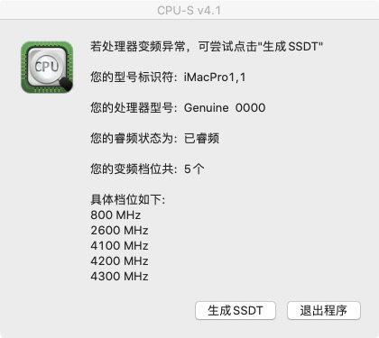
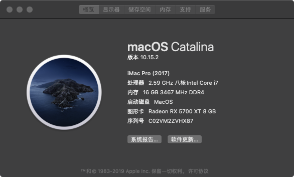
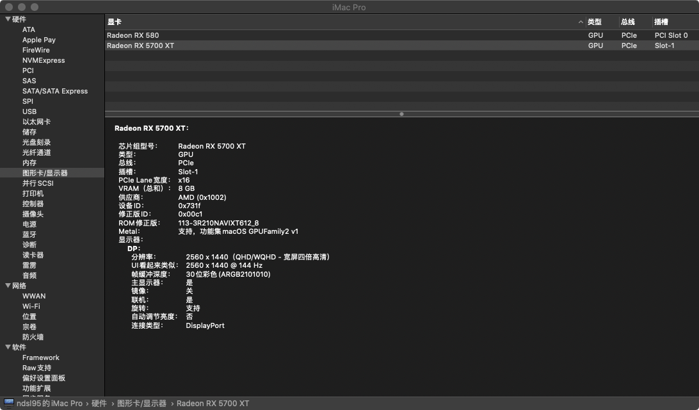
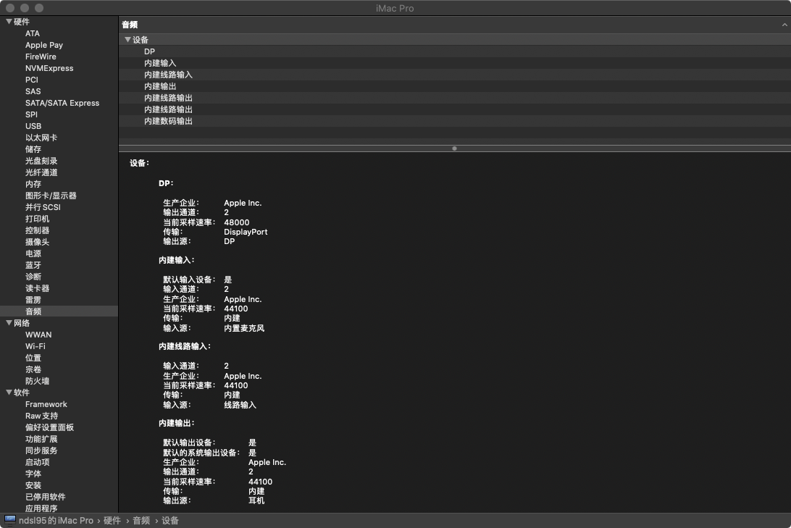
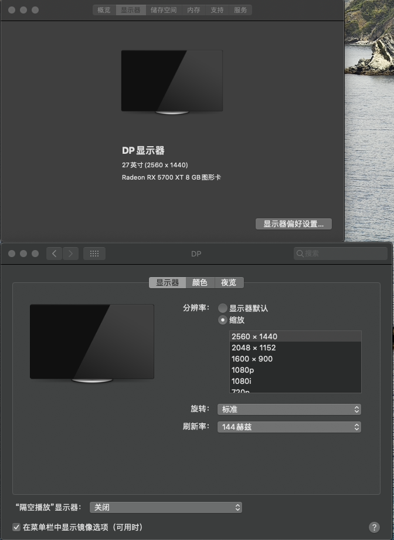

# Clover-EFI
Share Some Clover Configuration Files（分享一些黑苹果配置文件）

CPU： Intel QQM6 （Engineering Sample） 
主板: ASUS PRIME Z370-A (https://www.asus.com.cn/Motherboards/PRIME-Z370-A/) 
声卡: Realtek S1220A) 
有线网卡: Intel i219V2  
显卡: 5700xt & 580(8g 2304sp，目前主显示器插在5700xt上) 

Bug： 
1.睡眠似乎有问题，会睡死，因此我的解决办法是直接关闭睡眠 
2.我的键盘是是用罗技G710+,是用调节音量滚轮时，声音变化极端灵敏，而且系统音量大小的动画会卡顿，尚不知道什么问题。 

结论：
基于myd2898129的EFI修改，感谢myd2898129的前期工作，给我省去了大量的时间（源地址：http://bbs.pcbeta.com/viewthread-1829467-1-1.html) 
最开始是用myd2898129的EFI时出现 8 table load failures报错无法正常进入安装页面，经过查找后，发现需要做两个步骤： 
1.更新whatevergreen.kext到最新版本,我使用的版本为1.3.6 
2.在config.plist中的Boot-Arguments下添加agpdmod=pikera参数（没有Boot-Arguments参数可以自己添加，但是要注意上下文格式） 
（源地址：https://osx.cx/whatevergreen-kext-amd.html） 

